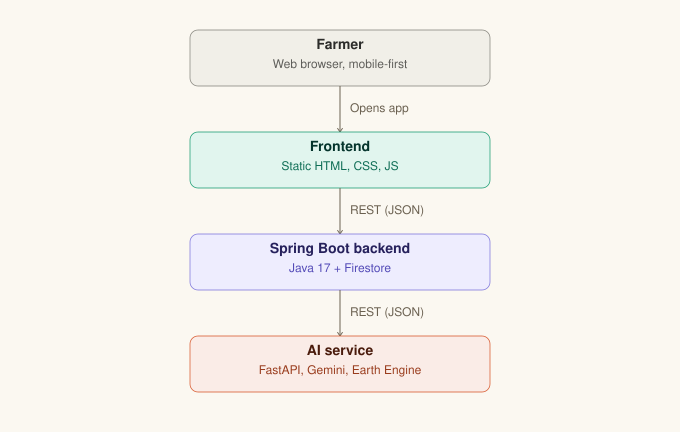

# KhetSaathi 
**AI-powered agricultural advisory network — built for India, designed to scale across BRICS nations**

*Hack2skill "Build with AI: Code for Communities — Second Edition" — Challenge #4: Digital Agriculture Network*

A farmer with a smartphone (or even just a spoken question) in any regional
language gets the same quality of agronomic guidance a well-resourced
commercial farm gets — powered by satellite data, real-time weather, soil
science, and generative AI.

---

## Live deployment

| Service | URL |
|---|---|
| **Frontend (app)** | `https://agri-network-frontend.onrender.com` |
| **Backend API** | `https://agri-network-backend.onrender.com` |
| **AI service** | `https://agri-network-ai.onrender.com` |

> Free-tier services (backend, AI service) sleep after inactivity and take 30–60s to wake on first request, so load them up first before you Test Frontend.


## What it does

- **Diagnose** — photograph a crop leaf, get an instant AI diagnosis and treatment advice (Gemini multimodal vision)
- **Advisory** — location-based planting recommendations combining satellite vegetation health (Google Earth Engine / Sentinel-2), live weather, and estimated soil data
- **Regenerative practices** — sustainable, soil-friendly farming recommendations, with an optional lab-soil-data input (falls back to SoilGrids estimates when omitted)
- **Ask (voice)** — speak or type a farming question, get a spoken/written answer in the farmer's own language
- **Regional alerts** — anonymized, district-level disease trend data shared across the network — the visible proof of this being a *digital public good*, not a single-farmer tool

## Architecture



<details>
<summary>Full text version with data sources per tier</summary>

```
Farmer (Web browser — mobile-first)
        │
        ▼
┌─────────────────────────┐
│  Frontend (static site)   │  index.html / style.css / app.js
│  - Web Speech API (STT/TTS, client-side, billing-free)
│  - Browser Geolocation API
└───────────┬───────────────┘
            │ REST (JSON)
            ▼
┌─────────────────────────┐
│  Spring Boot Backend       │  Java 17, deployed on Render
│  - Farmer profiles (Firestore)
│  - Advisory history & regional-alerts aggregation (Firestore)
│  - Orchestrates calls to the AI service
└───────────┬───────────────┘
            │ REST (JSON)
            ▼
┌─────────────────────────┐
│  AI Service                 │  Python/FastAPI, deployed on Render
│  - Gemini multimodal (diagnosis, advisory reasoning, voice responses)
│  - Google Earth Engine (Sentinel-2 NDVI)
│  - OpenWeatherMap (live forecast)
│  - SoilGrids (soil estimate fallback)
└─────────────────────────┘
```

</details>

## Tech stack

- **Backend:** Java 17, Spring Boot 3.3, Maven, Google Cloud Firestore
- **AI service:** Python, FastAPI, Google Gemini API (`gemini-3.6-flash`), Google Earth Engine, OpenWeatherMap, SoilGrids
- **Frontend:** Plain HTML/CSS/JS (no framework, no build step), Web Speech API
- **Infra:** Render (Web Services + Static Site), all on free tiers — no billing account required anywhere in the stack

## Why this satisfies the challenge requirements

- ✅ **Functioning end-to-end flow** — every feature above is live and deployed, not a mockup
- ✅ **Mandatory Google AI integration** — Gemini (generative reasoning + multimodal vision) and Earth Engine (predictive/geospatial)
- ✅ **Real/realistic data** — live satellite imagery, live weather, real soil-estimate data, no synthetic placeholders
- ✅ **Built for India, scalable across BRICS** — piloted in one Indian district, but built entirely on globally available data sources (Sentinel-2, global weather/soil APIs) and a country-agnostic data schema, not India-only datasets
- ✅ **Multilingual/voice support** — client-side speech recognition and synthesis, Gemini-generated responses in the requested language

## Repository structure

```
khetsaathi/
├── backend/          Spring Boot API — see backend/README.md for local setup
├── ai-service/        FastAPI AI service — see ai-service/README.md for local setup
├── frontend/          Static web app — see frontend/README.md for local setup
└── docs/
    └── api-contract.md   Shared API contract between backend and AI service
```

## Running locally

Each service has its own README with detailed setup steps. Quick start:

```bash
# Backend
cd backend
./mvnw spring-boot:run     # needs GOOGLE_APPLICATION_CREDENTIALS set for Firestore

# AI service
cd ai-service
pip install -r requirements.txt
uvicorn main:app --reload --port 8000   # needs GOOGLE_API_KEY, GEE_PROJECT_ID, etc. — see ai-service/README.md

# Frontend
cd frontend
python -m http.server 5500   # or just open index.html directly
```

## Credits & Attributions

This project builds on the following third-party services, datasets, and open-source libraries. All are used under their respective free/open terms; nothing here is redistributed as part of this codebase.

**Data & APIs**
- [Google Earth Engine](https://earthengine.google.com/) / [Copernicus Sentinel-2](https://sentinel.esa.int/web/sentinel/missions/sentinel-2) (ESA) — satellite NDVI vegetation-health data
- [Google Gemini API](https://ai.google.dev/) — multimodal diagnosis, advisory reasoning, and voice responses
- [OpenWeatherMap](https://openweathermap.org/) — live weather forecast data
- [SoilGrids](https://soilgrids.org/) (ISRIC — World Soil Information) — regional soil-property estimates, used as a fallback when a farmer hasn't submitted a lab soil test
- [Google Fonts](https://fonts.google.com/) — Fraunces, Space Grotesk

**Open-source frameworks & libraries**
- [Spring Boot](https://spring.io/projects/spring-boot) (Apache License 2.0)
- [FastAPI](https://fastapi.tiangolo.com/) (MIT License)
- [Project Lombok](https://projectlombok.org/) (MIT License)
- Google Cloud client libraries — `google-cloud-firestore`, `earthengine-api`, `google-genai` (Apache License 2.0)
- Browser-native [Web Speech API](https://developer.mozilla.org/en-US/docs/Web/API/Web_Speech_API) — no third-party library, built into the browser

No proprietary, closed-source, or improperly licensed code is used anywhere in this project. All application code (backend, AI service, frontend) was written by the team listed below during the hackathon period.

## Team

- **Backend, Frontend & deployment:** `Arun Rangad`
- **AI service integration:** `Shashank Nautiyal`
